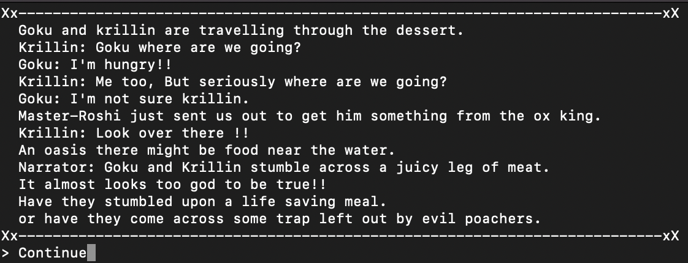

# Dragon Ball Z Text Based Combat Game

This a text based combat game almost like pookemon where you fight different Dragon Ball Z fighters against eachother. There is a main story mode which involves four chapters. You Travel through the desert searching for an item for master roshi as Goku. Fighting whoever comes in your path. Once you return eternal doom faces the very Island you love and know as Roshi's home. Do you have what it takes to save your friends Island. The is also a tutorial mode where you fight a weakened frieza as Goku in order to get used to the controls and flow of the game. There is also a free fight mode where you can choose your character and fight against any random fighter the computer chooses. 

Visit the deployed application [here]().

## Table of Contents
1. [User Experience (UX)](#user-experience-UX)
    1. [Project Goals](#project-goals)
    2. [User Stories](#user-stories)
    4. [Data Model](#data-model)
    5. [Flowchart](#flowchart)
2. [Features](#features)
    1. [Welcome Screen](#welcome-screen)
    2. [Main menu](#main-menu-screen)
    3. [Tutorial Screen](#tutorial-screen)
    4. [Story Screen](#story-screen)
    5. [Character Selection](#character-selection-screen)
    6. [HP Screen](#hp-screen)
    7. [Move Choice Screen](#move-choice-screen)
    8. [Enemy Turn](#enemy-turn-screen)
    9. [Enemy Move](#enemy-move-screen)
3. [Technologies Used](#technologies-used)
    1. [Language Used](#language-used)
    2. [Frameworks, Libraries and Programs Used](#frameworks-libraries-and-programs-used)
4. [Testing](#testing)
    1. [Testing User Stories](#testing-user-stories)
    2. [Code Validation](#code-validation)
    3. [Manual Testing](#manual-testing)
5. [Deployment](#deployment)
6. [Credits](#credits)
7. [Acknowledgements](#acknowledgements)

***

## User Experience (UX)

### Project Goals

* Provide a text based battle game that has a story mode, free battle mode and tutorial

* The story mode has multiple fights and text to create a sense of adventure with win and lose conditions.

* Provides input validation to help the user input the correct data.

* The program should keep running until the user decides otherwise.

### User Stories

* As a user, I want to receive information about the main objective of the program.

* As a user, I want to easily understand what input is needed on each step.

* As a user, I want to receive clear feedback in case I provide the wrong input.

* As a user, I want to know the remaining hp of the fighters to know where i stand in the battle after every attack

### Data Model

The main data for this game is the fighters. Theyre data is stored as objects where stats such as hp, attack, defence, special, speed.

There is input data collected and stored in variables for mening both for the main menu and the battle scene when a move is being selected

Damage calculation method takes in the appropriate damage of the move and a small and simple algorithym calculates the damage dealth based on the stats of the attacler and defender. This is then utilised to update the defending fighters remaining hp.

The remainning hp is utilised to display to the user how much health they have left. The hp stat is the overall hp the character starts with, which can be used to reset their hp to full if needed. 

### Flowchart

The following flowchart was designed using [Miro](https://miro.com/) in order to plan the logic to be implemented in the program.

As shown in the flowchart, this is the overall flow of the main menuing of the game

[Back to top ⇧](#Dragon-Ball-Z-Text-Based-Combat-Game)

## Features

### Welcome Screen

Introduce player to the game

Due to the biological characteristics needed for the BMR calculation, sex has been used over gender.

### Main Menu Screen

Allow the users to select the game mode they wish to play

### Tutorial Screen

Introduces the user to the tutorial fight and the objective of the battle.

### Story Screen

One of numerous screens that display the content of the story. This lays out the main storyline and the context for the upcoming fight.
 

### Character Selection Screen

Shows the menu for the character selection screen that is used for the free fight section of the main menu. The computer randomly chooses one of these characters for you to fight.

### HP Screen

Displays the current health points remaining from the the fighters in combat.

### Move Choice Screen

Displays the moves to the screen and waits for user inoput on what move to select for the user fighter.

### Enemy Turn Screen

Lets the player know it is the enemies turn.

### Enemy Move Screen

Displays the remaing hp to the screen after the enemys turn and tells you what move the enemy used.

[Back to top ⇧](#Dragon-Ball-Z-Text-Based-Combat-Game)

## Technologies Used

### Language Used

* [Python3](https://en.wikipedia.org/wiki/Python_(programming_language))

### Frameworks, Libraries and Programs Used

* [Pycharm](https://www.jetbrains.com/pycharm/) was used for writing code.

* [GitHub](https://github.com/) was used to store the project after pushing.

* [Heroku](https://id.heroku.com/) was used to deploy the application.

* [CI Python Linter](https://pep8ci.herokuapp.com/) was used to validate the Python code.
 
* [Miro](https://miro.com/) was used to create the program flowchart.

[Back to top ⇧](#Dragon-Ball-Z-Text-Based-Combat-Game)

## Testing

### Testing User Stories

* As a user, I want to receive information about the main objective of the program.

    - Information about the program is presented in the welcome message explaining the use of the game.

    - Details are provided in each section to explain what it is to do next.

* As a user, I want to easily understand what input is needed on each step.

    - Numbers are labbled beside the actions wanted to know which input to use to navigate the menu.

    - Input messages text continue is labled when just an enter is all that is neccissary.

* As a user, I want to receive clear feedback in case I provide the wrong input.

    - Error messages are provided explaining what is wrong with the input provided in case the wrong input is entered.

* As a user, I want to know the remaining hp of the fighters to know where I stand in the battle after every attack

    - During the batte the user and enemy hp remaining is printed to screen before any choices need to be made by the user.

    - After the enemys turn it is also printed to the screen to allow you to understand how much damage your opponent did and how much they could potentially do.

### Code Validation

The [CI Python Linter](https://pep8ci.herokuapp.com/#) was used continuosly during the development proces to validate the Python code. 

* Before

* After

### Manual Testing

<table>
    <tr>
        <th>Feature</th>
        <th>Outcome</th>
        <th>Example</th>
        <th>Pass/Fail</th>
    </tr>
    <tr>
        <td rowspan=4 >Main Menu</td>
        <td>Validate if value is invalid</td>
        <td></td>
        <td>Pass</td>
    </tr>
    <tr>
        <td>Validate if main menu input is invalid</td>
        <td></td>
        <td>Pass</td>
    </tr>
    <tr>
        <td>Validate if main menu input is option 1</td>
        <td></td>
        <td>Pass</td>
    </tr>
    <tr>
        <td>Validate if main menu input is option 2</td>
        <td></td>
        <td>Pass</td>
    </tr>
    <tr>
        <td>Validate if main menu input is option 3</td>
        <td></td>
        <td>Pass</td>
    </tr>
</table>

## Deployment

The application has been deployed using [Heroku](https://id.heroku.com/) by following these steps:

[Heroku](https://id.heroku.com/) was used to deploy the application.

1. Create the requirements.txt file and run: `pip3 freeze > requirements.txt` in the console.
2. Commit changes and push them to GitHub.
3. Go to the Heroku's website.
4. From the Heroku dashboard, click on "Create new app".
5. Enter the "App name" and "Choose a region" before clicking on "Create app".
6. Go to "Config Vars" under the "Settings" tab.
7. Click on "Reveals Config Vars" and add the KEY: CREDS and the VALUE stored in creds.json file if needed.
8. Add the Config Var, KEY: PORT and VALUE: 8000.
9. Go to "Buildpacks" section and click "Add buildpack".
10. Select "python" and click "Save changes"
11. Add "nodejs" buildpack as well using the same process.
12. Go to "Deployment method", under the "Deploy" tab select "GitHub" and click on "Connect to GitHub".
13. Go to "Connect to GitHub" section and "Search" the repository to be deployed.
14. Click "Connect" next the repository name.
15. Choose "Automatic deploys" or "Manual deploys" to deploy your application.

[Back to top ⇧](#macro-calculator)

## Credits

### Content

* Inspiration for this game primarily comes from my childhood/aldut adddiction with the main line [pokemon](https://www.pokemon.com/us) games. The turn based battle game with the stats is almost entirely inspired by the [first gen pokemon games](https://en.wikipedia.org/wiki/Pok%C3%A9mon_Red,_Blue,_and_Yellow) and the idea for using dragon ball z charatcers comes both from my love for the [anime](https://en.wikipedia.org/wiki/Dragon_Ball_Z) and a [pokemon mod](https://www.pokeharbor.com/2021/05/dragon-ball-z-team-training/) which allowed you to use dragon ball z fighters instead of pokemon.

### Media
* The ascii art was primarily gotten from [Dragonball Ascii art](https://ascii.co.uk/art/dragonball).

### Code
* [Stack Overflow](https://stackoverflow.com/) was consulted on a regular basis for inspiration and sometimes to be able to better understand the code being implement.

[Back to top ⇧](#Dragon-Ball-Z-Text-Based-Combat-Game)

## Acknowledgements

* My mento, Marcel, for his genuine interest in my best end result and invaluable support and guidance. Truly would not have done it without him.

* My friend and piano tuner for his support and feedback throughout the project.

* My friends, for their valuable opinions and and critic during the design and development process.

* Code Institute and its amazing Slack community for their support and providing me with the necessary knowledge to complete this project.
